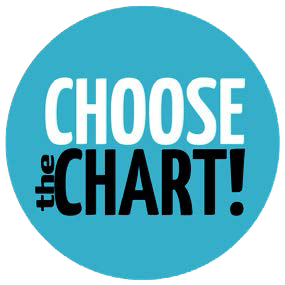

# Unterstützungstools zur Auswahl von Techniken zur Visualisierung von Daten
 

## Design und Vergleich eines Methodenkartensets mit einer Applikation für Tabletcomputer
 
 

 

 
 

> Vor der Nutzung diese Kartendecks oder dieser Ressource ist es wichtig unbedingt die Lizenz zu beachten!

### Kurzfassung:
Unterstützungstools zur Auswahl von Techniken zur Visualisierung von Daten
können ihren Beitrag zur Verbesserung der Data Literacy leisten, wenn sie angepasst
an die jeweilige Zielgruppe konzipiert und designt sind. In der vorliegenden
Arbeit wurden zwei Chart-Chooser-Tools, ein Methodenkartenset und eine Anwendung
für Tabletcomputer, konzipiert und designt, um Akademiker*innen verschiedener
Fachrichtungen bei der Auswahl der passenden Charts zu unterstützen.
Der Fokus der Untersuchungen wurde auf die Fragen der möglichen Gestaltung
der Tools, die Qualität der damit erzielten Ergebnisse und die Usability gelegt. Es
wurde dazu die Frage gestellt, ob und wie sich das analoge vom digitalen ChartChooser-
Tool unterscheidet. Um diese Forschungsfragen beantworten zu können,
wurde ein Praxistest und eine Befragung mit Repräsentant*innen aus der
Zielgruppe durchgeführt. Eine Evaluation durch Expert*innen bewertete die, im
Rahmen des User*innentests, von den Proband*innen getroffene Chartauswahl.
Die Ergebnisse der Untersuchungen zeigen, dass die gewählte Struktur der Tools,
unterstützt durch die Farbcodes und die grafisches Gestaltung von den Proband*
innen sehr gut angenommen und bewertet wurden. Es konnte auch keine
Präferenz der User*innen für eines der beiden Tools erkannt werden. Wesentlich
für ein positives Feedback durch die User*innen scheint jedoch zu sein, dass das
digitale Tool die, in diesem Medium möglichen Funktionen beinhaltet.
Die Qualität der Ergebnisse, die mit einem der beiden Tools erarbeitet wurden,
unterschied sich nicht wesentlich. Bei beiden Chart-Chooser-Tools wurden rund
70% der genannten Charts als passend zu den gegebenen Datenbeispielen bewertet.
Um dieses Ergebnis zu erhöhen, wäre eine Verbesserung der inhaltlichen
Verständlichkeit hilfreich. Diese kann durch zusätzliche reale Chartbeispiele erreicht
werden. Ob diese als externes Online-Zusatzangebot oder direkt im Tool
angeboten werden sollen, muss in weiterer Forschung geklärt werden.

### Abstract:
Support tools for data visualization can contribute improving data literacy if they
are designed and adapted to the specific target group. In this work, two chart
chooser tools, a method chart set and an application for tablet computers, were
conceived and designed to support academics from different disciplines in selecting
the appropriate charts.
This research was focused on questions of possible design of the tools, quality
of results obtained with them and usability. Therefore, it was asked whether and
how the analogue chart chooser tool differs from the digital chart chooser tool. In
order to answer these research questions, a practical test and a survey with representatives
of the target group as well as an expert evaluation were conducted.
Findings of the research show that chosen structures of the tools, supported by
color codes and the graphical design, were very well accepted and evaluated by
the participants. No preference of users for one of the two tools could be identified.
However, it seems to be essential that digital tools offer functions that are
possible in this medium.
The quality of the results obtained with one of the two tools did not differ significantly.
In both cases, the test persons named about 70% suitable charts for the
given data examples. In order to increase this result, it would be helpful to improve
the comprehensibility of the content. This can be achieved by additional real chart
examples. Whether these should be offered as an external online supplement or
directly in the tool must be clarified in further research.

## Methodenkartenset

